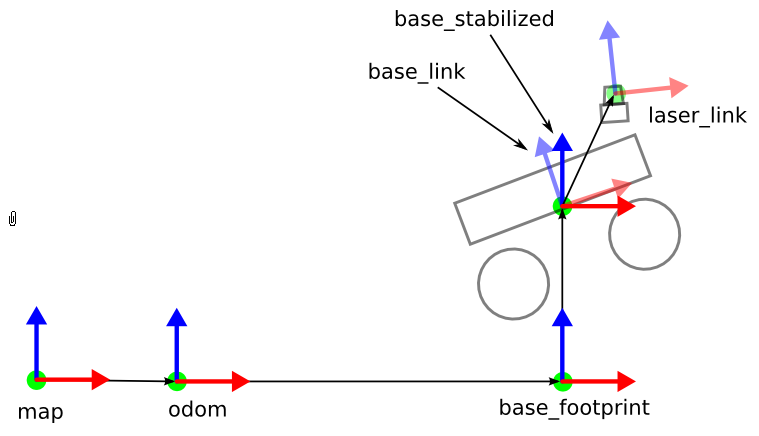
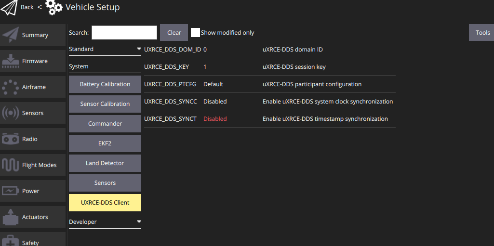
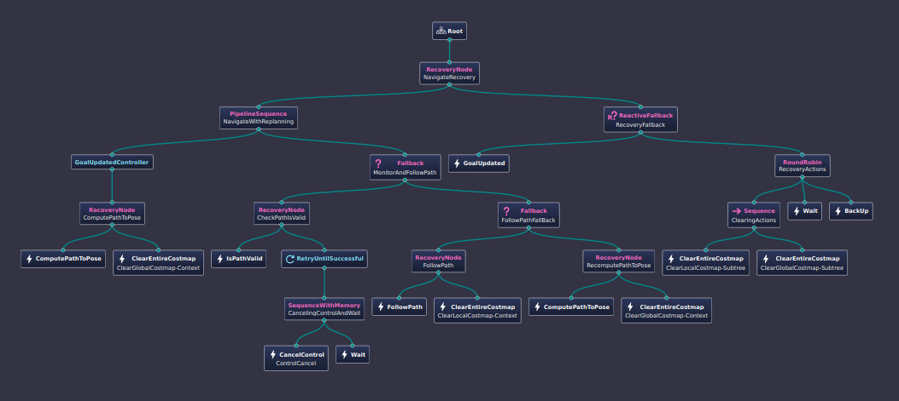

# DD_Nav_WS

Our navigation software stack is run through ROS(Robotic Operating System) and so to run this stack we need to use a ROS Workspace to hold all of our code, which is contained is ros packages.

For our ROS workspace the main workspace is DD_Nav_WS, however all work will be done inside of the dd_gazebo_ws folder.

Inside of the dd_gazebo_ws folder is a folder called dd_gazebo. This folder is a package. ROS uses packages to hold all source code for any project using ROS. The main difference between a package and a normal folder is that a package needs to be built whenever the code inside it is changed so that the code can be used when the package is called. Building a package is done through a package management service called colcon. To build all packages in a workspace call the following command from inside a terminal in the workspace: 

colcon build

If you are calling “colcon build” for the first time then it will create a build folder and an install folder. You do not need to know exactly what these folders do. The most important thing to know is that the code inside of the install/share folder is the code that can be accessed whenever you call a ros command. Thus, if some piece of source code is not in this folder, then it cannot be accessed by ROS. You configure what folders from the ROS WS go into the install folder when a package is built by editing the install() command at the bottom of the CMakeLists.txt file.

o

 ros launch simulation.launch.py

This command will launch Rviz and Gazebo with a drone with a lidar, imu and camera attached to it.

**Additional Points:**

- The model of the drone is stored in the drone_description.urdf file to edit what the drone looks like or what is attached to the drone you must edit this file
- All current gazebo worlds are stored in the worlds folder
- **EVERYTIME YOU OPEN A NEW WINDOW CALL**: source /opt/ros/humble/setup.bash & source install/setup.bash(only call this one if you are using something from the dd_gazebo_ws) - you can also add these to your .bashrc file so they are auto-called everytime you open a new terminal

**Pre-Requisites:**

- ROS 2 Humble must be installed, go through the setup guide on resources if it is not installed already.

[Resources](../Resources%20d446878c6ced413f8ee5734b8a3ebe4c.md)

Use the following commands to install the rest of the dependencies(this should be a comprehensive list, but add any that you find are needed that aren’t currently on it):

```
sudo apt install ros-humble-joint-state-publisher-gui
sudo apt install ros-humble-xacro
sudo apt install ros-humble-gazebo-ros-pkgs
sudo apt install ros-humble-robot-localization
sudo apt install ros-humble-slam-toolbox
sudo apt install ros-humble-navigation2
sudo apt install ros-humble-nav2-bringup
sudo apt install ros-humble-spatio-temporal-voxel-layer

```

### **Install PX4:** [https://docs.px4.io/main/en/ros2/user_guide.html](https://docs.px4.io/main/en/ros2/user_guide.html)

You need to install the PX4 development toolchain in order to use the simulator.

**INFO:** The only dependency ROS 2 has on PX4 is the set of message definitions, which it gets from [**px4_msgs**](https://github.com/PX4/px4_msgs). You only need to install PX4 if you need the simulator (as we do in this guide), or if you are creating a build that publishes custom uORB topics.

Set up a PX4 development environment on Ubuntu in the normal way:

```
cd
git clone https://github.com/PX4/PX4-Autopilot.git --recursive
bash ./PX4-Autopilot/Tools/setup/ubuntu.sh
cd PX4-Autopilot/
make px4_sitl
```

Note that the above commands will install the recommended simulator for your version of Ubuntu. If you want to install PX4 but keep your existing simulator installation, run `ubuntu.sh` above with the `--no-sim-tools` flag.

For more information and troubleshooting see: [**Ubuntu Development Environment**](https://docs.px4.io/main/en/dev_setup/dev_env_linux_ubuntu.html) and [**Download PX4 source**](https://docs.px4.io/main/en/dev_setup/building_px4.html).

**Installing Python dependencies:**

```
pip install --user -U empy==3.3.4 pyros-genmsg setuptools 
```

### **Setup Micro XRCE-DDS Agent & Client**

For ROS 2 to communicate with PX4, [**uXRCE-DDS client**](https://docs.px4.io/main/en/modules/modules_system.html#uxrce-dds-client) must be running on PX4, connected to a micro XRCE-DDS agent running on the companion computer.

### **Setup the Agent**

The agent can be installed onto the companion computer in a [**number of ways**](https://docs.px4.io/main/en/middleware/uxrce_dds.html#micro-xrce-dds-agent-installation). Below we show how to build the agent "standalone" from source and connect to a client running on the PX4 simulator.

To setup and start the agent:

1. Open a terminal.
2. Enter the following commands to fetch and build the agent from source:

```
git clone https://github.com/eProsima/Micro-XRCE-DDS-Agent.git
cd Micro-XRCE-DDS-Agent
mkdir build
cd build
cmake ..
make
sudo make install
sudo ldconfig /usr/local/lib/
```

1. Start the agent with settings for connecting to the uXRCE-DDS client running on the simulator:
    
    ```
    
    MicroXRCEAgent udp4 -p 8888
    ```
    

The agent is now running, but you won't see much until we start PX4 (in the next step).

**INFO**

You can leave the agent running in this terminal! Note that only one agent is allowed per connection channel.

### **Start the Client**

The PX4 simulator starts the uXRCE-DDS client automatically, connecting to UDP port 8888 on the local host.

To start the simulator (and client):

1. Open a new terminal in the root of the **PX4 Autopilot** repo that was installed above.

```
make px4_sitl gazebo-classic
```

(if this command look at the note below)

The agent and client are now running they should connect. If you encounter an error along the lines of gazebo sim not installed, rerun the package dependancies command to install gazebo-classic and rerun the command again.

The PX4 terminal displays the [**NuttShell/PX4 System Console**](https://docs.px4.io/main/en/debug/system_console.html) output as PX4 boots and runs. As soon as the agent connects the output should include `INFO` messages showing creation of data writers:

`...`

`INFO  [uxrce_dds_client] synchronized with time offset 1675929429203524usINFO  [uxrce_dds_client] successfully created rt/fmu/out/failsafe_flags data writer, topic id: 83`

`INFO  [uxrce_dds_client] successfully created rt/fmu/out/sensor_combined data writer, topic id: 168`

`INFO  [uxrce_dds_client] successfully created rt/fmu/out/timesync_status data writer, topic id: 188`

`...`

The micro XRCE-DDS agent terminal should also start to show output, as equivalent topics are created in the DDS network:

`...`

`[1675929445.268957] info     | ProxyClient.cpp    | create_publisher         | publisher created      | client_key: 0x00000001, publisher_id: 0x0DA(3), participant_id: 0x001(1)`

`[1675929445.269521] info     | ProxyClient.cpp    | create_datawriter        | datawriter created     | client_key: 0x00000001, datawriter_id: 0x0DA(5), publisher_id: 0x0DA(3)`

`[1675929445.270412] info     | ProxyClient.cpp    | create_topic             | topic created          | client_key: 0x00000001, topic_id: 0x0DF(2), participant_id: 0x001(1)`

`...`

### NOTE FOR LAUNCHING PX4 GAZEBO SIMULATION:

If you originally were using the new gazebo simulation(not gazebo classic 11) and your “make px4_sitl gazebo-classic” command is not working, you will need to install gazebo classic 11 and then clear the px4 cache, so that it now uses the old gazebo(gazebo classic 11) when launching its simulation. The commands to clear the cache(execute in PX4_Autopilot repository):

```python
make clean
make distclean
```

### Structure of the Workspace:

The main folder of the workspace is the dd_gazebo_ws folder. It has four folders: build, install, log and src. The build and install folders are generated when you build the packages in the workspace using colcon, which is a package manager and wrapper of Cmake that converts the scripts in the packages in the src folder into executables that can be launched by ROS2. The log folder just contains log files from the builds and launching of different files. The src folder contains all of the packages/folders with actual code. The two main packages are the drone_nav folder and the px4_offboard folder. The px4_offboard folder is used to launch a Gazebo simulation with the drone and teleop control of it and a corresponding Rviz visualization window. The drone_nav folder contains all of the source code for the actual navigation software and so it is the folder where new code pertaining to navigation, localization, and mapping should be added. All the source code for the folder is currently in C++, but if you need to write a python source file that can be configured(ask in discord). The launch files are in python. There is currently one: [navigation.launch.py](http://navigation.launch.py) that broadcasts the transforms of the robot, and the transforms from the base_link frame of the robot to a stabilized_base_link frame(one without roll or pitch), and then to a base_footprint frame(the stabilized frame but on the ground/z-axis = 0, only able to move in x, y, and angular z/yaw directions) then from the base_footprint to odom frame, which is the center of the local map. Then the map frame is the global center of the map. The map→odom transform is broadcasted by SLAM or some localization system.

It is worth learning more about what coordinate frames and frame transforms are in the context of robotics and in particular ROS2, but a quick overview is that a coordinate frame tells you where everything is w.r.t(with respect to) that center of the frame, so the laser_link gives the distance of everything w.r.t to the lidar. However, if the lidar detects an object 3 meters in front of it and I want to plot that object on a map of the environment, then I have to know how to transform my coordinate frame from that of the lidar to that of the global map, thus you publish a transform that tells ROS2 where the lidar is w.r.t the map so that now the map knows where the object is w.r.t to it. However, you actually publish multiple different transforms to get from the lidar to the map as you publish one for each part of the robot and the one for the local map(odom) and one for the global map(map).



The px4_msgs is a package that contains all of the px4 specific message types that PX4 uses to communicate with ROS programs. px4_ros_com is a package that helps PX4 and ROS communicate with each other(it has methods to help convert from px4 coordinate frame orientation standards to ROS standards).

CMake Error at /opt/ros/humble/share/rosidl_generator_c/cmake/rosidl_generator_c_generate_interfaces.cmake:184 (find_package):
By not providing "Findament_cmake_cpplint.cmake" in CMAKE_MODULE_PATH this
project has asked CMake to find a package configuration file provided by
"ament_cmake_cpplint", but CMake did not find one.

Could not find a package configuration file provided by
"ament_cmake_cpplint" with any of the following names:

ament_cmake_cpplintConfig.cmake
ament_cmake_cpplint-config.cmake

```
sudo apt update && sudo apt install -y \
python3-flake8-docstrings \
python3-pip \
python3-pytest-cov \
ros-dev-tools
```

```
sudo apt install -y \
python3-flake8-blind-except \
python3-flake8-builtins \
python3-flake8-class-newline \
python3-flake8-comprehensions \
python3-flake8-deprecated \
python3-flake8-import-order \
python3-flake8-quotes \
python3-pytest-repeat \
python3-pytest-rerunfailures
```

## Setting up Repository:

Once you clone the DD_Nav_WS repository to your local machine, go to the DD_Nav_WS/gazebo_ws/src folder and then delete the px4_msgs and px4_ros_com folders and then in this same folder execute the following commands:

```python
git clone https://github.com/PX4/px4_msgs.git
git clone https://github.com/PX4/px4_ros_com.git
```

Then, execute the command: “colcon build” in the repository from the folder DD_Nav_WS/dd_gazebo_ws

### **Essential Step for Running the Simulation:**

The current hexacopter model being used in the simulation is the px4 typhoon_h480. However, additional sensors have been added to the model. Thus, to simulate the modified typhoon_h480 model you must copy the typhoon_h480.sdf.jinja file from the location: /DD_Nav_WS/dd_gazebo_ws/src/drone_nav/description/typhoon_h480.sdf.jinja

to the location:

/PX4-Autopilot/Tools/simulation/gazebo-classic/sitl_gazebo-classic/models/typhoon_h480.sdf.jinja

You must do this to run the simulation with the modified hexacopter as the px4 gazebo simulations always look for the models from the folder: /PX4-Autopilot/Tools/simulation/gazebo-classic/sitl_gazebo-classic/models

The simulation is currently configured with a 3d lidar(like that of the velodyne vlp-16) and a depth camera like that of the Zed2i; however, if you want the simulation to use a 2d-lidar then copy the typhoon_h480_2d.sdf.jinja file instead. Also, change the urdf file in the [navigation.launch.py](http://navigation.launch.py) file in the drone_nav package to drone_model_2d.urdf(this file does not contain a depth camera, so you will not be able to see any point cloud). Finally, go to the offboard_velocity_control.launch.py file in the px4_offboard package and change the rviz file to 2d_drone_config.rviz

### Running the Simulation:

To run the simulation you must call multiple commands from the dd_gazebo_ws folder:

1. To build the workspace the first time call “colcon build” to build all of the packages(folders in the src directory) or “colcon build —packages-select {Certain Package}” every subsequent time to only build the certain packages that you have changed
2. source the new local setup file for the workspace by calling “source install/setup.bash”
3. source the global setup file for ROS2 Humble “source /opt/ros/humble/setup.bash”
4. Call the command “ros2 launch px4_offboard offboard_velocity_control.launch.py” to launch the gazebo simulation with teleop control and the Rviz visualizer
5. Call the command “ros2 launch drone_nav navigation.launch.py” to launch the command that loads the drone into Rviz and broadcasts the proper transforms and odometry messages necessary for the proper functioning of the drone software.

### Downloading and Configuring QGroundControl:

To have ROS2 and PX4 communicate properly through the Gazebo simulator you must make sure that both the ROS2 nodes(programs) and PX4 programs both using clock of the Gazebo simulator and not the real clock, so that Gazebo, PX4 and ROS2 all have the same time frame. The ROS2 nodes are already using Gazebo’s clock as they each currently have their “use_sim_time” parameter set to True. To set PX4 to use the Gazebo you must download QGroundControl to set the correct parameter.

To download QGroundControl: go to https://docs.qgroundcontrol.com/master/en/qgc-user-guide/getting_started/download_and_install.html

and follow the steps for Ubuntu Linux.

Once you have QGroundControl installed and you are **running the gazebo simulation**,  you must go to “Q” in the top left corner of the screen, then scroll down the left side and click on the “Parameters” tab, then scroll down and click the “UXRCE-DDS Client” tab and click it. Then disable the UXRCE_DDS_SYNCT parameter. Then to apply it click on the “Tools” tab in top right corner and click the “refresh” button.



### Adding New Code:

If you are adding new code you might need to modify the Cmake and package.xml files to get it to build properly. If it is configuration code(.urdf, .sdf, .yaml…) and it is in a pre-existing folder, no modifications need to be made. If you create new folder or create a new src file(.py or .cpp) you will need to modify these files. Further documentation will be added to describe what needs to be done, but for now just ask in Discord as needed.

## **IMPORTANT NOTE:**

To stop the gazebo simulation and Rviz or any program in general enter the command “Ctrl C” in the terminal, DO NOT EXIT OUT OF THE GUI’s, this could cause it to shutdown improperly, requiring you to restart your computer to get the simulation and visualizer to load properly. Sometimes the gazebo window freezes and crashes, if this occurs Ctrl C to stop all of the terminals and re-run the launch command until the gazebo simulation starts properly.

## Robot Model Information:

[Sensors:](DD_Nav_WS/Sensors%20e94344b552aa46d5a784de80ba5df225.md)

## Information About Navigation Stack:

[Global Path Planner](DD_Nav_WS/Global%20Path%20Planner%20a948cd788c91487bb3cde7f9ce5dd15b.md)



# Eigen Package issue

- If you get the following error

```jsx
-- stderr: Eigen3
CUDA_TOOLKIT_ROOT_DIR not found or specified
CMake Error: File /home/raghav/DD_Nav_WS/lib/eigen-3.4.0/scripts/buildtests.in does not exist.
CMake Error at scripts/CMakeLists.txt:2 (configure_file):
  configure_file Problem configuring file

---
Failed   <<< Eigen3 [5.45s, exited with code 1]
Aborted  <<< px4_msgs [3min 19s]
```

- You need to install the following files from this github and add it to DD_Nav_WS/lib/eigen-3.4.0/scripts/ file
- [https://github.com/ValveSoftware/eigen/tree/3.4/scripts](https://github.com/ValveSoftware/eigen/tree/3.4/scripts)
    - [buildtests.in](http://buildtests.in)